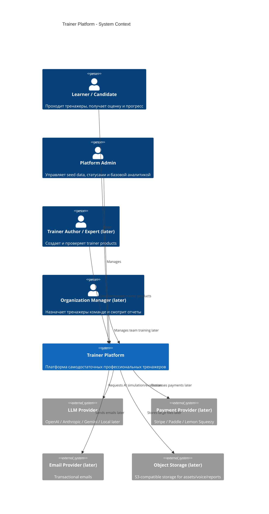
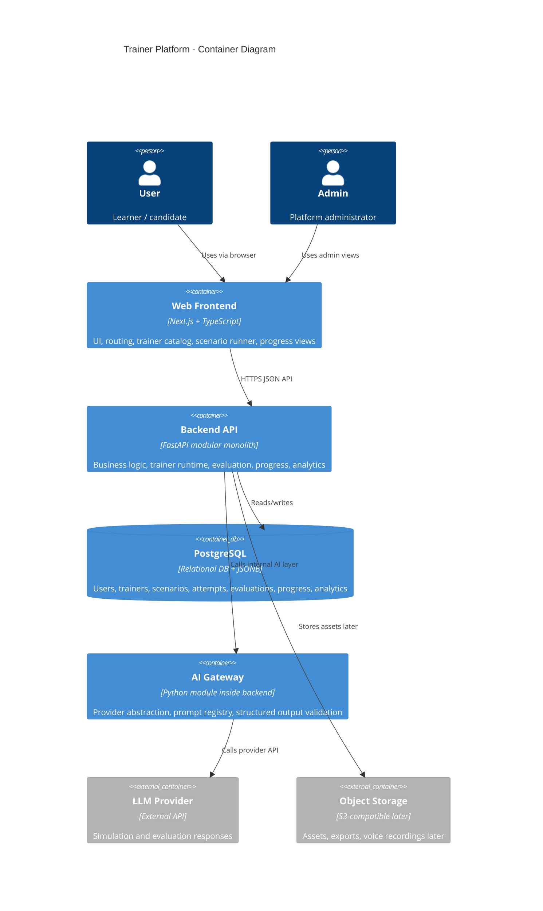
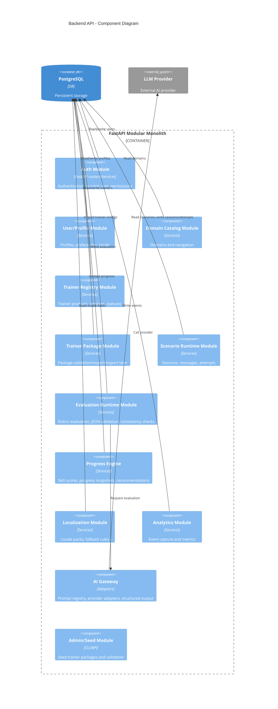
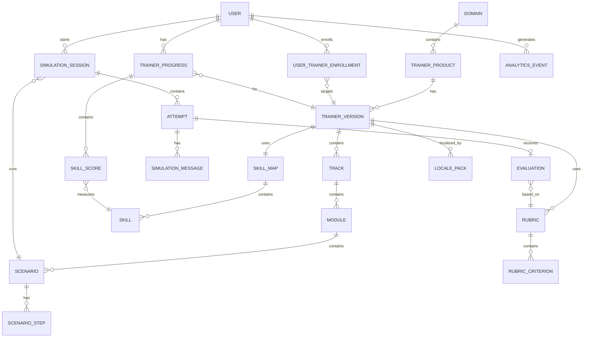
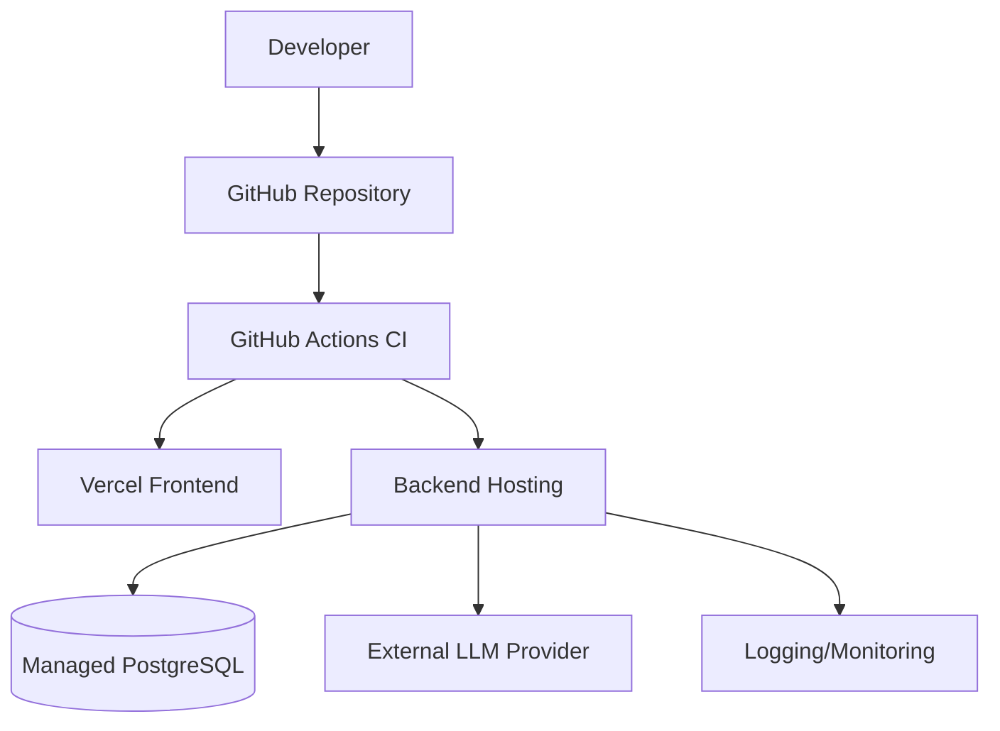

# System / Solution Architect Documentation Pack
# Платформа самодостаточных профессиональных тренажеров

**Версия:** 0.1  
**Дата:** 03.06.2026  
**Автор позиции:** System / Solution Architect  
**Владелец продукта:** Product Owner / Founder  
**Входные документы:** Product Owner Documentation Pack v0.1, Business Analyst Documentation Pack v0.1, Product Manager Documentation Pack v0.1  
**Статус:** Draft for Engineering / AI / UX / QA / DevOps Review  
**Язык документа:** RU  

---

## 0. Назначение документа

Этот документ фиксирует архитектурное видение системы: как должна быть устроена платформа самодостаточных профессиональных тренажеров технически, логически и организационно.

Документ отвечает на вопросы:

- какие основные модули нужны системе;
- как разделяются Platform Core и Trainer Products;
- как устроены данные;
- как проходит пользовательская сессия тренажера;
- как работает AI evaluation;
- как строится мультиязычность;
- как будет разворачиваться MVP;
- какие архитектурные решения приняты и почему;
- какие нефункциональные требования нельзя нарушать.

Документ является входом для:

- Backend Engineering;
- Frontend Engineering;
- AI / LLM Architect;
- DevOps / Infrastructure Engineer;
- QA Lead;
- Data / Analytics Specialist;
- UX/UI Designer;
- Learning Experience Designer;
- Domain Experts.

---

## 1. Executive Architecture Summary

Мы создаем не LMS, не универсальный AI-чат и не одну “мега-машину” с разделами.

Мы создаем **платформу для создания, публикации и прохождения самодостаточных профессиональных тренажеров**.

Архитектурная формула:

```text
Platform Core = общая инфраструктура и runtime.
Domain = навигационная и продуктовая группировка.
Trainer Product = самостоятельный тренажер внутри домена.
Trainer Package = переносимый пакет тренажера: metadata + skill map + rubrics + scenarios + locales + tests.
Scenario Runtime = механизм прохождения сценария.
Evaluation Runtime = механизм оценки попытки по рубрике.
Progress Engine = накопление прогресса пользователя внутри конкретного trainer product.
AI Gateway = единая точка доступа к LLM-провайдерам и AI-ролям.
```

Первый MVP:

```text
Domain: IT
Trainer Product: QA Engineer Interview Trainer
Mode: text-only
Locales: ru-RU, en-US
Architecture: modular monolith first
Backend: FastAPI
Database: PostgreSQL
Frontend: Next.js + TypeScript
AI: AI Gateway + provider adapters + rubric-based evaluation
```

---

## 2. Architecture Goals

| ID | Goal | Description | Priority |
|---|---|---|---|
| AG-001 | Поддержать self-contained trainer products | Каждый тренажер должен быть самостоятельным продуктом, а не разделом одной большой машины | Must |
| AG-002 | Доказать платформенную модель на одном тренажере | MVP должен запустить один полноценный trainer product от каталога до оценки и прогресса | Must |
| AG-003 | Сохранить расширяемость на другие домены | Архитектура должна позволять добавлять Medicine, Sales, Languages, Cybersecurity и другие домены | Must |
| AG-004 | Изолировать AI-логику | Нельзя вызывать LLM напрямую из бизнес-логики; нужен AI Gateway | Must |
| AG-005 | Обеспечить rubric-based evaluation | Оценка пользователя должна быть структурированной, объяснимой и сохраняемой | Must |
| AG-006 | Поддержать версионирование тренажеров | Пользовательские попытки должны быть привязаны к версии тренажера и сценария | Must |
| AG-007 | Поддержать локализацию как locale packs | Локализация должна учитывать язык и рынок, а не только перевод | Must |
| AG-008 | Не перегрузить MVP | Voice, marketplace, B2B dashboard, full authoring studio, RAG не входят в MVP | Must |
| AG-009 | Подготовить будущую монетизацию | В MVP допускаются тарифные/usage placeholders, но полноценный billing позже | Should |
| AG-010 | Поддержать наблюдаемость и AI cost tracking | Нужно понимать ошибки, стоимость AI и прохождение сценариев | Should |

---

## 3. Architecture Principles

### 3.1. Platform Core is not a Trainer

Платформа отвечает за общую инфраструктуру:

```text
auth
users
domains
trainer registry
scenario runtime
evaluation runtime
progress
localization
analytics
AI gateway
billing later
authoring later
review workflow later
```

Но предметная методика живет в `Trainer Product`.

### 3.2. Trainer Product is self-contained

Каждый тренажер должен иметь:

```text
metadata
target audience
skill map
scenario packs
rubric packs
localization packs
version
status lifecycle
quality checks
progress model
```

### 3.3. Trainer Package first

Архитектура должна позволять хранить тренажер как переносимый пакет:

```text
qa_engineer_interview_trainer/
├── trainer.json
├── skill_map.json
├── rubric_pack.json
├── scenarios/
│   ├── tell_about_yourself.json
│   ├── bug_report_case.json
│   └── api_testing_case.json
├── locales/
│   ├── ru-RU.json
│   └── en-US.json
└── tests/
    └── trainer_validation_cases.json
```

На старте пакет может импортироваться через seed scripts. Позже — через Authoring Studio.

### 3.4. Rubric before AI opinion

AI не должен оценивать свободным текстом. Оценка должна строиться на фиксированной рубрике:

```text
answer
→ rubric criteria
→ evaluation JSON
→ consistency validation
→ persisted result
→ user feedback
```

### 3.5. Version everything that affects evaluation

Версионируются:

```text
trainer product
scenario
rubric
skill map
AI prompt template
evaluation contract
locale pack
```

Это нужно, чтобы через полгода понимать: по какой версии сценария и рубрики пользователь получил score.

### 3.6. Modular monolith first

MVP должен быть modular monolith, а не микросервисы.

Причина:

- меньше инфраструктурной сложности;
- проще разработка;
- проще тесты;
- проще транзакционная целостность;
- быстрее MVP;
- границы модулей можно выделить в коде;
- позже можно вынести отдельные сервисы.

### 3.7. AI Gateway is mandatory

Бизнес-логика не должна знать, какой LLM-провайдер используется.

Должен быть слой:

```text
AI Gateway
├── OpenAI Adapter
├── Anthropic Adapter later
├── Gemini Adapter later
└── Local Adapter later
```

### 3.8. Data ownership must be explicit

Каждый модуль владеет своими сущностями:

```text
User/Profile module → users, profiles
Trainer Registry → domains, trainer_products, trainer_versions
Scenario Runtime → sessions, messages, attempts
Evaluation Runtime → evaluations, rubric_results
Progress Engine → trainer_progress, skill_scores
Analytics → analytics_events
Localization → locale packs, translated fields
```

---

## 4. System Scope

### 4.1. MVP In Scope

```text
Frontend web app
Backend API
PostgreSQL schema
Auth basic
User profile
Domain catalog
Trainer product catalog
One self-contained trainer product
Trainer versioning
Scenario runtime
Text-only scenario interaction
Attempt persistence
Rubric-based AI evaluation
Evaluation JSON validation
Progress per trainer product
Basic analytics events
ru-RU / en-US localization
Admin seed data
Basic error handling
Tests
Proof JSON
```

### 4.2. MVP Out of Scope

```text
Voice mode
VR/AR
Marketplace
Full Authoring Studio
B2B organization dashboard
Enterprise SSO
Certificates as legally meaningful credentials
Medical/legal/cybersecurity high-risk trainers without expert review
Complex RAG
Real-time multiplayer training
Mobile native apps
Advanced payments
Human expert marketplace
```

### 4.3. Architecture Must Prepare For Later

```text
multiple trainer products
multiple domains
trainer package import/export
expert review workflow
authoring studio
B2B organizations
billing
voice mode
RAG knowledge packs
certificates
marketplace
```

---

## 5. High-Level Architecture

```text
[User Browser]
      |
      v
[Next.js Frontend]
      |
      v
[FastAPI Modular Monolith]
      |
      +--> Auth Module
      +--> User/Profile Module
      +--> Domain Catalog Module
      +--> Trainer Registry Module
      +--> Trainer Package Module
      +--> Scenario Runtime Module
      +--> Evaluation Runtime Module
      +--> Progress Engine Module
      +--> Localization Module
      +--> Analytics Module
      +--> Billing Placeholder Module
      +--> Admin/Seed Module
      +--> AI Gateway Module
      |
      v
[PostgreSQL]
      |
      +--> relational data
      +--> JSONB trainer configs
      +--> analytics events
      +--> future pgvector
      |
      v
[External AI Provider]
```

---

## 6. C4 Diagrams

### 6.1. C4 Level 1 — System Context Diagram



### 6.2. C4 Level 2 — Container Diagram



### 6.3. C4 Level 3 — Backend Component Diagram



---

## 7. Domain Model

### 7.1. Core Domain Concepts

```text
Platform
Domain
Trainer Product
Trainer Version
Trainer Package
Track
Module
Scenario
Scenario Step
Attempt
Evaluation
Skill Map
Skill
Rubric
Rubric Criterion
Progress
Certificate
Locale Pack
Analytics Event
```

### 7.2. Concept Definitions

| Concept | Definition |
|---|---|
| Platform | Общая инфраструктура, через которую создаются, публикуются и проходятся тренажеры |
| Domain | Крупная профессиональная область: IT, Medicine, Sales, Languages |
| Trainer Product | Самодостаточный тренажер внутри домена |
| Trainer Version | Версия тренажера, к которой привязаны сценарии, рубрики и skill map |
| Trainer Package | Переносимый набор файлов/данных, описывающий trainer product |
| Track | Направление внутри тренажера, например HR interview, API testing interview |
| Module | Группа сценариев внутри track |
| Scenario | Конкретная профессиональная ситуация для тренировки |
| Scenario Step | Шаг сценария: вопрос, контекст, проверка, branching later |
| Attempt | Один проход сценария пользователем |
| Evaluation | Оценка attempt по рубрике |
| Skill Map | Карта навыков тренажера |
| Skill | Отдельный измеримый навык |
| Rubric | Набор критериев оценки |
| Rubric Criterion | Конкретный критерий с весом и описанием уровней |
| Progress | Динамика пользователя внутри trainer product |
| Certificate | Итоговый статус/документ после выполнения условий, later |
| Locale Pack | Локализация текстов, сценариев, feedback и контекста |
| Analytics Event | Событие поведения пользователя или системы |

### 7.3. Domain Model Diagram



---

## 8. Proposed Data Model

### 8.1. Tables — MVP

```text
users
user_profiles
domains
trainer_products
trainer_versions
trainer_localizations
tracks
modules
scenarios
scenario_steps
skill_maps
skills
rubrics
rubric_criteria
user_trainer_enrollments
simulation_sessions
simulation_messages
attempts
evaluations
evaluation_criteria_results
trainer_progress
skill_scores
analytics_events
ai_requests
```

### 8.2. Tables — Later

```text
organizations
organization_members
team_assignments
billing_plans
subscriptions
payments
certificates
trainer_packages
trainer_reviews
author_profiles
expert_reviews
content_publication_workflows
object_assets
voice_recordings
report_exports
```

### 8.3. Key Entity Fields

#### domains

```json
{
  "id": "uuid",
  "slug": "it",
  "name": "IT",
  "description": "Information technology trainers",
  "status": "active",
  "sort_order": 10,
  "created_at": "datetime",
  "updated_at": "datetime"
}
```

#### trainer_products

```json
{
  "id": "uuid",
  "domain_id": "uuid",
  "slug": "qa-engineer-interview-trainer",
  "name": "QA Engineer Interview Trainer",
  "product_type": "interview_simulator",
  "target_audience": ["junior_qa", "middle_qa"],
  "status": "draft|published|archived",
  "created_at": "datetime",
  "updated_at": "datetime"
}
```

#### trainer_versions

```json
{
  "id": "uuid",
  "trainer_product_id": "uuid",
  "version": "1.0.0",
  "status": "draft|review|published|deprecated",
  "default_locale": "ru-RU",
  "supported_locales": ["ru-RU", "en-US"],
  "skill_map_id": "uuid",
  "release_notes": "Initial MVP version",
  "published_at": "datetime|null"
}
```

#### scenarios

```json
{
  "id": "uuid",
  "module_id": "uuid",
  "trainer_version_id": "uuid",
  "rubric_id": "uuid",
  "slug": "tell-about-yourself",
  "scenario_type": "interview_question",
  "difficulty": "junior",
  "estimated_duration_minutes": 8,
  "status": "published",
  "metadata": {}
}
```

#### attempts

```json
{
  "id": "uuid",
  "user_id": "uuid",
  "simulation_session_id": "uuid",
  "scenario_id": "uuid",
  "trainer_version_id": "uuid",
  "status": "started|completed|evaluation_failed|evaluated",
  "started_at": "datetime",
  "completed_at": "datetime|null",
  "transcript_snapshot": []
}
```

#### evaluations

```json
{
  "id": "uuid",
  "attempt_id": "uuid",
  "rubric_id": "uuid",
  "rubric_version": "1.0.0",
  "ai_prompt_version": "1.0.0",
  "overall_score": 74,
  "passed": true,
  "critical_errors": [],
  "weak_points": [],
  "next_recommendation": "Practice STAR structure",
  "raw_ai_response": {},
  "validated_response": {},
  "created_at": "datetime"
}
```

---

## 9. Module Boundaries

### 9.1. Auth Module

Responsibilities:

```text
registration
login
session/current user
role checks
basic permissions
```

Does not own:

```text
trainer progress
billing
organization management later
```

### 9.2. User/Profile Module

Responsibilities:

```text
profile
preferred locale
country/market preference
learning goals later
```

### 9.3. Domain Catalog Module

Responsibilities:

```text
domain list
domain details
domain status
navigation grouping
```

### 9.4. Trainer Registry Module

Responsibilities:

```text
trainer products
trainer versions
publication status
supported locales
trainer metadata
```

Does not own:

```text
scenario execution
evaluation
progress calculation
```

### 9.5. Trainer Package Module

Responsibilities:

```text
trainer package schema
package validation
package seed import
package export later
```

MVP implementation:

```text
seed scripts + validation schemas
```

Later:

```text
Authoring Studio integration
```

### 9.6. Scenario Runtime Module

Responsibilities:

```text
start session
load scenario
show next step
capture message
complete attempt
store transcript snapshot
```

Does not decide:

```text
final score
skill progress
billing
```

### 9.7. Evaluation Runtime Module

Responsibilities:

```text
load rubric
prepare evaluation prompt
call AI Gateway
validate structured JSON
run consistency checks
persist evaluation
return feedback to user
```

### 9.8. Progress Engine

Responsibilities:

```text
update progress per trainer product
update skill scores
track attempts
calculate improvement
suggest next scenario
```

### 9.9. Localization Module

Responsibilities:

```text
locale resolution
fallback
localized trainer/scenario/rubric texts
feedback templates
```

### 9.10. Analytics Module

Responsibilities:

```text
capture events
store event payload
support product metrics
support cost metrics
```

### 9.11. AI Gateway

Responsibilities:

```text
provider abstraction
prompt template versioning
structured output request
retry policy
timeout policy
cost logging
provider response storage
```

Does not own:

```text
business decision
progress calculation
scenario lifecycle
```

---

## 10. Data Flow

### 10.1. User Registration Flow

```text
User
→ Frontend registration form
→ Backend Auth Module
→ users table
→ user_profiles table
→ analytics event: user_registered
→ Frontend profile/dashboard
```

### 10.2. Trainer Discovery Flow

```text
User opens catalog
→ Frontend requests domains/trainers
→ Domain Catalog + Trainer Registry
→ localized trainer cards
→ analytics event: trainer_viewed
```

### 10.3. Enrollment Flow

```text
User clicks "Start trainer"
→ Backend checks trainer status and locale
→ user_trainer_enrollments created
→ initial trainer_progress created
→ analytics event: trainer_enrolled
```

### 10.4. Scenario Start Flow

```text
User selects scenario
→ Scenario Runtime validates access
→ creates simulation_session
→ creates attempt
→ loads scenario steps and localized text
→ analytics event: scenario_started
→ returns first prompt/question
```

### 10.5. Answer Submission Flow

```text
User submits answer
→ Scenario Runtime stores simulation_message
→ analytics event: answer_submitted
→ if scenario complete: mark attempt completed
→ trigger evaluation
```

### 10.6. Evaluation Flow

```text
Attempt completed
→ Evaluation Runtime loads rubric
→ Evaluation Runtime builds evaluation prompt
→ AI Gateway calls provider
→ AI Gateway logs ai_request
→ Evaluation Runtime validates JSON
→ consistency check
→ persist evaluation
→ Progress Engine updates skill scores
→ analytics event: evaluation_received
→ Frontend displays score/feedback/recommendation
```

### 10.7. Progress Flow

```text
Evaluation persisted
→ Progress Engine reads criterion results
→ maps criteria to skills
→ updates skill_scores
→ updates trainer_progress summary
→ calculates next recommendation
→ analytics event: progress_updated
```

---

## 11. AI Flow

### 11.1. AI Roles in MVP

MVP requires only:

```text
Evaluator Agent
Coach Feedback Formatter
```

Not required in MVP:

```text
Interviewer Agent with complex branching
Scenario Generator Agent
Localization Agent
Safety Agent as separate agent
Voice Agent
```

However, architecture must prepare for them.

### 11.2. MVP AI Evaluation Flow

```text
User answer + scenario context + rubric
→ evaluation prompt
→ LLM structured JSON response
→ schema validation
→ consistency check
→ persisted evaluation
→ user-facing feedback
```

### 11.3. Evaluation Contract

```json
{
  "overall_score": 0,
  "passed": false,
  "criteria": [
    {
      "criterion_id": "clarity",
      "score": 0,
      "max_score": 5,
      "evidence": "quote or summary from user answer",
      "feedback": "specific explanation",
      "improvement_advice": "specific next step"
    }
  ],
  "critical_errors": [],
  "weak_points": [],
  "strengths": [],
  "next_recommendation": {
    "type": "retry|next_scenario|review_material",
    "reason": "why this recommendation was selected"
  }
}
```

### 11.4. AI Guardrails

Evaluation must fail safely if:

```text
LLM returns invalid JSON
LLM omits required criteria
LLM gives score outside allowed range
LLM feedback contradicts score
LLM response contains unsafe advice
LLM response is not in requested locale
provider timeout occurs
provider returns rate limit
```

### 11.5. AI Request Logging

Store:

```text
provider
model
prompt_template_id
prompt_version
input_tokens
output_tokens
latency_ms
cost_estimate
status
error_code
attempt_id
evaluation_id
```

Do not expose raw provider internals to user.

---

## 12. Localization Architecture

### 12.1. Supported MVP Locales

```text
ru-RU
en-US
```

### 12.2. Locale Resolution

Priority:

```text
1. User selected locale
2. User profile preferred locale
3. Trainer default locale
4. Platform default locale
```

### 12.3. Locale Pack Concept

Locale pack contains:

```text
trainer title/description
scenario titles
scenario prompts
rubric labels
feedback templates
UI labels
market-specific examples
disclaimers
```

### 12.4. Fallback Rules

```text
If scenario has requested locale → use it.
If not → use trainer default locale.
If no default → block scenario publication.
```

MVP rule:

```text
Published trainer must have complete ru-RU and en-US locale coverage for all user-facing P0 flows.
```

---

## 13. API Architecture

### 13.1. API Style

```text
REST JSON API
Versioned under /api/v1
OpenAPI generated by FastAPI
```

### 13.2. Proposed MVP Endpoints

#### Auth/Profile

```text
POST /api/v1/auth/register
POST /api/v1/auth/login
GET  /api/v1/me
PATCH /api/v1/me/profile
```

#### Domains / Trainers

```text
GET /api/v1/domains
GET /api/v1/domains/{domain_slug}
GET /api/v1/trainers
GET /api/v1/trainers/{trainer_slug}
GET /api/v1/trainers/{trainer_slug}/versions/current
```

#### Enrollment

```text
POST /api/v1/trainers/{trainer_slug}/enroll
GET  /api/v1/me/enrollments
```

#### Scenarios

```text
GET  /api/v1/trainers/{trainer_slug}/scenarios
GET  /api/v1/scenarios/{scenario_id}
POST /api/v1/scenarios/{scenario_id}/start
POST /api/v1/sessions/{session_id}/messages
POST /api/v1/sessions/{session_id}/complete
```

#### Evaluations

```text
POST /api/v1/attempts/{attempt_id}/evaluate
GET  /api/v1/attempts/{attempt_id}/evaluation
```

#### Progress

```text
GET /api/v1/me/progress
GET /api/v1/me/progress/{trainer_slug}
```

#### Analytics

```text
POST /api/v1/analytics/events
```

Admin/seed endpoints should be protected or implemented as CLI scripts in MVP.

---

## 14. Frontend Architecture

### 14.1. Recommended Stack

```text
Next.js
TypeScript
Tailwind CSS
shadcn/ui
TanStack Query
Zustand or simple context for MVP
next-intl or i18next
```

### 14.2. Frontend Areas

```text
Public landing
Auth screens
Domain catalog
Trainer product page
Scenario runner
Evaluation result page
Progress dashboard
Basic admin/seed status page later
```

### 14.3. Frontend Route Model

```text
/
/login
/register
/domains
/domains/[domainSlug]
/trainers/[trainerSlug]
/trainers/[trainerSlug]/scenarios
/scenarios/[scenarioId]/run
/attempts/[attemptId]/result
/me/progress
/me/progress/[trainerSlug]
```

### 14.4. Frontend State

Server state:

```text
TanStack Query
```

Local UI state:

```text
Zustand/simple React state
```

Do not store authoritative progress in browser localStorage.

---

## 15. Backend Architecture

### 15.1. Recommended Stack

```text
FastAPI
Python 3.12+
Pydantic v2
SQLAlchemy 2.x
Alembic
PostgreSQL
pytest
ruff
mypy optional
```

### 15.2. Backend Project Structure

```text
backend/
├── app/
│   ├── main.py
│   ├── config.py
│   ├── db/
│   ├── modules/
│   │   ├── auth/
│   │   ├── users/
│   │   ├── domains/
│   │   ├── trainers/
│   │   ├── packages/
│   │   ├── scenarios/
│   │   ├── evaluations/
│   │   ├── progress/
│   │   ├── localization/
│   │   ├── analytics/
│   │   └── ai_gateway/
│   ├── shared/
│   └── tests/
├── alembic/
└── pyproject.toml
```

### 15.3. Backend Module Rule

Modules may call each other through service interfaces, not by directly manipulating each other's tables unless via repositories.

Example:

```text
Scenario Runtime completes attempt
→ calls Evaluation Service
→ Evaluation Service calls AI Gateway
→ Evaluation Service emits EvaluationCreated
→ Progress Service updates progress
```

MVP can use synchronous service calls. Later, events/queues may be introduced.

---

## 16. Deployment Model

### 16.1. MVP Deployment

```text
Frontend: Vercel
Backend: Render / Railway / Fly.io / Hetzner VPS
Database: Managed PostgreSQL / Supabase / Neon
Storage: not required for MVP
CI/CD: GitHub Actions
```

### 16.2. Environments

```text
local
staging
production
```

### 16.3. Environment Responsibilities

| Environment | Purpose |
|---|---|
| local | Development |
| staging | QA, demo, integration testing |
| production | Real users |

### 16.4. Deployment Diagram



### 16.5. CI/CD Minimum

```text
lint frontend
test frontend
build frontend
lint backend
test backend
run migrations check
build backend container later
deploy staging
manual promotion to production initially
```

---

## 17. Security Architecture

### 17.1. MVP Security Requirements

```text
HTTPS only
password hashing if custom auth
secure session/JWT handling
role-based access checks
input validation
output validation for AI responses
SQL injection protection through ORM
no secrets in frontend
no provider keys in logs
basic rate limiting for AI endpoints
```

### 17.2. Data Protection

Personal data MVP:

```text
email
name/display name optional
locale
progress
answers/transcripts
AI evaluation results
```

Sensitive data warning:

```text
User answers may contain personal information. Store and display them carefully.
```

### 17.3. AI Security

```text
prompt injection resistance
scenario boundary enforcement
no hidden system prompt exposure
structured output validation
unsafe domain blocking for high-risk trainers
```

### 17.4. Access Control

MVP roles:

```text
guest
registered_user
admin
```

Later:

```text
trainer_author
expert_reviewer
organization_owner
team_manager
employee
support_admin
```

---

## 18. Observability and Monitoring

### 18.1. Required Logs

```text
request logs
error logs
AI provider errors
evaluation validation failures
scenario runtime failures
auth failures
migration status
```

### 18.2. Required Metrics

```text
API latency
error rate
evaluation latency
AI cost per evaluation
scenario completion rate
evaluation failure rate
registration rate
activation rate
```

### 18.3. Tracing MVP

MVP can use request IDs and structured logs.

Each attempt/evaluation should have traceable IDs:

```text
user_id
session_id
attempt_id
evaluation_id
ai_request_id
```

---

## 19. Performance Requirements

### 19.1. MVP Targets

| Area | Target |
|---|---|
| Catalog page load | < 2s perceived |
| Scenario start | < 2s excluding network |
| Answer save | < 1s |
| Evaluation generation | target < 15s, acceptable < 30s |
| Progress page | < 2s |
| API p95 non-AI endpoints | < 500ms |
| API p95 AI endpoint | provider-dependent, tracked |

### 19.2. Performance Strategy

```text
Keep MVP text-only
Use pagination for catalogs later
Do not run unnecessary AI calls
Cache static trainer metadata later
Store evaluation results once
Avoid recalculating progress from scratch on every request
```

---

## 20. Scalability Strategy

### 20.1. MVP Scale Assumption

```text
0–1,000 active users
1 trainer product
5–20 scenarios
ru-RU and en-US
synchronous evaluation
```

### 20.2. Next Scale Step

```text
1,000–10,000 active users
multiple trainer products
background evaluation queue
Redis
object storage
cost monitoring
rate limits
```

### 20.3. Future Extraction Candidates

If modular monolith grows, these modules may become services:

```text
AI Gateway
Evaluation Runtime
Analytics
Billing
Authoring/Review
Report generation
```

Do not extract before there is real load or team need.

---

## 21. Cost Architecture

### 21.1. Main Cost Drivers

```text
LLM input/output tokens
number of evaluation calls
consistency check calls
voice processing later
storage later
database hosting
backend hosting
monitoring
```

### 21.2. MVP Cost Controls

```text
text-only
one evaluation call per completed attempt
no blind retries
max answer length
model selection by task
store and reuse evaluation result
rate limits per user
usage tracking
```

### 21.3. AI Cost Event

Each evaluation should produce cost metadata:

```json
{
  "ai_request_id": "uuid",
  "attempt_id": "uuid",
  "provider": "openai",
  "model": "selected-model",
  "input_tokens": 0,
  "output_tokens": 0,
  "estimated_cost_usd": 0.0,
  "latency_ms": 0,
  "status": "success"
}
```

---

## 22. Reliability and Failure Handling

### 22.1. Failure Scenarios

```text
AI provider timeout
AI provider rate limit
invalid AI JSON
database unavailable
frontend loses connection during attempt
user refreshes page during scenario
locale pack missing
rubric missing
scenario unpublished
attempt already evaluated
```

### 22.2. Required Behaviors

| Failure | Required Behavior |
|---|---|
| AI timeout | Mark evaluation as failed/retryable, do not lose attempt |
| Invalid AI JSON | Store error, show controlled message, allow retry later |
| User refreshes | Restore active session if possible |
| Missing locale | Fallback or block publication |
| Missing rubric | Scenario cannot be published |
| Duplicate evaluation request | Return existing evaluation or idempotent response |
| Rate limit | Show controlled message |

### 22.3. Idempotency

Important operations should be idempotent:

```text
enroll trainer
start scenario if active session exists
complete attempt
evaluate attempt
analytics event ingestion optional deduplication
```

---

## 23. Quality Gates

### 23.1. Trainer Publication Gate

A trainer version cannot be published unless:

```text
trainer metadata valid
domain exists
skill map valid
rubric pack valid
all scenarios have rubrics
all P0 locales complete
test cases pass
no high-risk domain without expert review flag
```

### 23.2. Scenario Publication Gate

A scenario cannot be published unless:

```text
has title/description
has supported locale content
has scenario goal
has at least one user-facing step
has rubric
has difficulty
has expected behavior
has critical error rules
```

### 23.3. Evaluation Gate

Evaluation is valid only if:

```text
JSON schema valid
all rubric criteria scored
scores within range
overall score consistent
feedback present
evidence present
locale matches user locale
```

---

## 24. Non-Functional Requirements

### 24.1. Performance

| ID | Requirement | Priority |
|---|---|---|
| NFR-PERF-001 | Non-AI API endpoints should respond under 500ms p95 in MVP scale | Should |
| NFR-PERF-002 | Evaluation result should usually return within 15–30 seconds | Should |
| NFR-PERF-003 | Progress page should not recalculate all attempts synchronously for large history | Should |

### 24.2. Scalability

| ID | Requirement | Priority |
|---|---|---|
| NFR-SCALE-001 | Architecture must support multiple trainer products without schema rewrite | Must |
| NFR-SCALE-002 | Trainer versioning must support historical attempts | Must |
| NFR-SCALE-003 | AI evaluation can move from sync to async later without changing domain model | Must |

### 24.3. Security

| ID | Requirement | Priority |
|---|---|---|
| NFR-SEC-001 | Secrets must never be exposed to frontend or logs | Must |
| NFR-SEC-002 | User answers and evaluations must be access-controlled | Must |
| NFR-SEC-003 | Admin/seed operations must be protected | Must |
| NFR-SEC-004 | AI output must be validated before saving as trusted evaluation | Must |

### 24.4. AI Cost

| ID | Requirement | Priority |
|---|---|---|
| NFR-COST-001 | Every AI request must be logged with model and cost metadata where possible | Must |
| NFR-COST-002 | MVP must avoid unnecessary duplicate evaluations | Must |
| NFR-COST-003 | Rate limits must protect from uncontrolled AI spend | Should |

### 24.5. Observability

| ID | Requirement | Priority |
|---|---|---|
| NFR-OBS-001 | Each attempt/evaluation must be traceable | Must |
| NFR-OBS-002 | AI failures must be visible in logs/metrics | Must |
| NFR-OBS-003 | Product funnel events must be captured from MVP | Should |

### 24.6. Reliability

| ID | Requirement | Priority |
|---|---|---|
| NFR-REL-001 | Completed attempt must not be lost if evaluation fails | Must |
| NFR-REL-002 | Evaluation retry should not create duplicate conflicting evaluations | Must |
| NFR-REL-003 | Missing rubric/locale must fail before publication, not during user attempt | Must |

### 24.7. Localization

| ID | Requirement | Priority |
|---|---|---|
| NFR-LOC-001 | MVP must support ru-RU and en-US in P0 flows | Must |
| NFR-LOC-002 | Locale fallback must be deterministic | Must |
| NFR-LOC-003 | Published trainer must not have incomplete required locale content | Must |

### 24.8. Extensibility

| ID | Requirement | Priority |
|---|---|---|
| NFR-EXT-001 | New trainer products should be addable through data/package, not code rewrite | Must |
| NFR-EXT-002 | New AI providers should be addable through adapters | Should |
| NFR-EXT-003 | Future voice mode should integrate without rewriting scenario/evaluation model | Should |

---

# PART B. Technical Decision Records / ADR

---

## ADR-001: Use Modular Monolith First

**Status:** Accepted  
**Date:** 03.06.2026  

### Context

The platform must support multiple domains and self-contained trainer products, but the first MVP has only one trainer product.

### Decision

Use a modular monolith backend built with FastAPI.

### Rationale

```text
faster MVP
lower operational complexity
simpler transactions
easier debugging
clear module boundaries still possible
future service extraction possible
```

### Consequences

Positive:

```text
faster development
simpler deployment
less DevOps overhead
```

Negative:

```text
requires discipline in module boundaries
future extraction may be needed
```

---

## ADR-002: Use PostgreSQL as Primary Database

**Status:** Accepted  
**Date:** 03.06.2026  

### Context

The platform requires relational data, versioning, progress, attempts, analytics and structured trainer metadata.

### Decision

Use PostgreSQL as the primary database.

### Rationale

```text
strong relational integrity
JSONB support for flexible trainer metadata
works well with SQLAlchemy
supports future pgvector
mature managed hosting
```

### Consequences

Positive:

```text
single reliable data store for MVP
easy migrations
future vector support possible
```

Negative:

```text
event analytics at very large scale may need separate warehouse later
```

---

## ADR-003: Use FastAPI for Backend

**Status:** Accepted  
**Date:** 03.06.2026  

### Context

The system is AI-heavy and requires integration with LLM providers, structured validation, evaluation pipelines and future RAG/voice features.

### Decision

Use FastAPI + Python for backend.

### Rationale

```text
Python AI ecosystem
Pydantic validation
OpenAPI generation
good async support
easy integration with LLM SDKs
```

### Consequences

Positive:

```text
fast AI feature development
clear schemas
developer-friendly API
```

Negative:

```text
requires careful async/blocking management
```

---

## ADR-004: Use Trainer Package Model

**Status:** Accepted  
**Date:** 03.06.2026  

### Context

The product must support many self-contained trainers in the future.

### Decision

Represent each trainer product as a package containing metadata, skill map, rubrics, scenarios, locales and tests.

### Rationale

```text
trainer products become portable
quality gates can validate packages
future marketplace/authoring becomes easier
versions are easier to manage
```

### Consequences

Positive:

```text
clean separation between platform and trainer content
better scalability across domains
easier expert review
```

Negative:

```text
requires package schema discipline
```

---

## ADR-005: Use AI Gateway Instead of Direct OpenAI Calls

**Status:** Accepted  
**Date:** 03.06.2026  

### Context

The system should not be locked into one AI provider and must log AI cost, latency and failures.

### Decision

All AI calls must go through AI Gateway.

### Rationale

```text
provider abstraction
model fallback later
central cost tracking
central prompt registry
central output validation
security boundary
```

### Consequences

Positive:

```text
less vendor lock-in
better observability
consistent AI behavior
```

Negative:

```text
slightly more upfront architecture
```

---

## ADR-006: Start Text-Only; Prepare Voice Later

**Status:** Accepted  
**Date:** 03.06.2026  

### Context

Voice mode is valuable but adds STT/TTS cost, latency, UX and testing complexity.

### Decision

MVP is text-only. Data model should not prevent voice later.

### Rationale

```text
lower complexity
lower cost
faster MVP
easier evaluation validation
```

### Consequences

Positive:

```text
faster launch
simpler QA
lower AI/audio cost
```

Negative:

```text
less realistic interview experience in MVP
```

---

## ADR-007: Use Rubric-Based Structured Evaluation

**Status:** Accepted  
**Date:** 03.06.2026  

### Context

Free-form AI feedback is not enough for a trainer platform.

### Decision

All evaluations must be rubric-based and persisted as structured JSON.

### Rationale

```text
explainable scoring
progress tracking
comparison between attempts
testability
quality control
```

### Consequences

Positive:

```text
more trustworthy feedback
better analytics
easier QA
```

Negative:

```text
requires strong rubric design
```

---

## ADR-008: Use Locale Packs, Not Simple Translation

**Status:** Accepted  
**Date:** 03.06.2026  

### Context

Localization requires language + market + professional context.

### Decision

Use locale packs for trainer/scenario/rubric/feedback content.

### Rationale

```text
supports market-specific content
better user trust
future internationalization
```

### Consequences

Positive:

```text
higher quality localization
better expansion model
```

Negative:

```text
more content work than simple translation
```

---

## ADR-009: Do Not Implement Full Authoring Studio in MVP

**Status:** Accepted  
**Date:** 03.06.2026  

### Context

Authoring Studio is important but not required to prove the platform model.

### Decision

MVP uses seed/import scripts and package validation. Full authoring later.

### Rationale

```text
keeps MVP focused
reduces UI complexity
still validates package model
```

### Consequences

Positive:

```text
faster MVP
less admin UI
```

Negative:

```text
content creation remains developer/admin assisted in MVP
```

---

## ADR-010: Store Attempts and Evaluations as Historical Records

**Status:** Accepted  
**Date:** 03.06.2026  

### Context

Users need progress history and trainers will evolve over time.

### Decision

Attempts/evaluations are immutable historical records linked to trainer/scenario/rubric versions.

### Rationale

```text
auditability
progress comparison
historical correctness
version traceability
```

### Consequences

Positive:

```text
trustworthy history
better analytics
```

Negative:

```text
updates require new records, not overwriting
```

---

# PART C. Integration Architecture

---

## 25. External Integrations

### 25.1. MVP Integrations

```text
LLM provider
Email provider optional
Hosting provider
Database provider
```

### 25.2. Later Integrations

```text
Payment provider
Object storage
STT/TTS provider
Analytics warehouse
B2B SSO
LMS integration
CRM integration for sales trainers
Calendar integration for scheduled training
```

---

## 26. Internal Integration Contracts

### 26.1. Scenario Runtime → Evaluation Runtime

Input:

```json
{
  "attempt_id": "uuid",
  "scenario_id": "uuid",
  "trainer_version_id": "uuid",
  "transcript": [],
  "locale": "ru-RU"
}
```

Output:

```json
{
  "evaluation_id": "uuid",
  "status": "evaluated|failed",
  "overall_score": 0
}
```

### 26.2. Evaluation Runtime → AI Gateway

Input:

```json
{
  "task_type": "rubric_evaluation",
  "provider_preference": "default",
  "prompt_template_id": "qa_interview_eval_v1",
  "input": {
    "scenario_context": {},
    "rubric": {},
    "transcript": []
  },
  "output_schema": "EvaluationContractV1"
}
```

Output:

```json
{
  "status": "success",
  "validated_json": {},
  "provider_metadata": {
    "model": "model-name",
    "input_tokens": 0,
    "output_tokens": 0,
    "latency_ms": 0
  }
}
```

### 26.3. Evaluation Runtime → Progress Engine

Input:

```json
{
  "user_id": "uuid",
  "trainer_version_id": "uuid",
  "attempt_id": "uuid",
  "evaluation_id": "uuid",
  "criteria_results": []
}
```

Output:

```json
{
  "trainer_progress_id": "uuid",
  "updated_skill_scores": [],
  "next_recommendation": {}
}
```

---

## 27. Event Architecture

MVP can store events synchronously in PostgreSQL.

### 27.1. Required Events

```text
user_registered
user_logged_in
domain_viewed
trainer_viewed
trainer_enrolled
scenario_viewed
scenario_started
answer_submitted
attempt_completed
evaluation_requested
evaluation_received
evaluation_failed
progress_viewed
retry_started
```

### 27.2. Event Schema

```json
{
  "event_id": "uuid",
  "event_name": "scenario_started",
  "user_id": "uuid|null",
  "anonymous_id": "string|null",
  "occurred_at": "datetime",
  "properties": {
    "domain_slug": "it",
    "trainer_slug": "qa-engineer-interview-trainer",
    "scenario_id": "uuid",
    "locale": "ru-RU"
  }
}
```

---

## 28. Architecture Risks

| Risk ID | Risk | Severity | Mitigation |
|---|---|---:|---|
| AR-001 | MVP becomes too broad | High | Strict MVP scope and out-of-scope gates |
| AR-002 | Trainer products become hardcoded | High | Trainer package model and registry |
| AR-003 | AI evaluation is inconsistent | High | Rubric-based JSON, validation, test set |
| AR-004 | LLM vendor lock-in | Medium | AI Gateway and provider adapters |
| AR-005 | Localization becomes simple translation | Medium | Locale packs and publication gates |
| AR-006 | AI cost grows uncontrollably | High | AI request logging, rate limits, text-only MVP |
| AR-007 | Progress becomes inaccurate after trainer updates | High | Versioned trainer/scenario/rubric records |
| AR-008 | High-risk domains create legal/safety issues | High | Expert review required, domain gates |
| AR-009 | Analytics missing from MVP | Medium | Analytics module and event schema from day one |
| AR-010 | Modular monolith becomes messy | Medium | Module boundaries and ADR governance |

---

## 29. Architecture Acceptance Criteria

### 29.1. Platform Core

```gherkin
Given the platform has a published trainer product
When a registered user opens the trainer catalog
Then the user can view the trainer product in the correct locale
```

### 29.2. Trainer Product Self-Containment

```gherkin
Given a trainer package contains metadata, skill map, rubric pack, scenarios and locale packs
When the package validation runs
Then the system confirms whether the trainer product is publishable
```

### 29.3. Scenario Runtime

```gherkin
Given a user is enrolled in a trainer product
When the user starts a scenario
Then the system creates a simulation session and attempt linked to the trainer version
```

### 29.4. Evaluation Runtime

```gherkin
Given a completed attempt exists
When evaluation is requested
Then the system evaluates it using the scenario rubric and stores structured evaluation JSON
```

### 29.5. Progress Engine

```gherkin
Given an evaluation is stored
When the progress engine processes the result
Then the user's progress is updated only for the relevant trainer product
```

### 29.6. Versioning

```gherkin
Given a trainer product has version 1.0.0
When a user completes a scenario
Then the attempt and evaluation are linked to trainer version 1.0.0
```

### 29.7. Localization

```gherkin
Given the user selected en-US
When the user opens a published scenario
Then all required user-facing scenario and rubric texts are available in en-US
```

### 29.8. AI Failure Handling

```gherkin
Given the AI provider returns invalid JSON
When the backend processes the response
Then the system stores a controlled evaluation failure and does not corrupt user progress
```

---

## 30. Architecture Implementation Roadmap

### Phase 1 — MVP Architecture

```text
modular monolith backend
PostgreSQL schema
basic auth
trainer registry
trainer package seed validation
scenario runtime
evaluation runtime
AI gateway
progress engine
localization
analytics events
frontend P0 flows
tests
```

### Phase 2 — Product Strengthening

```text
better progress analytics
retry recommendations
scenario packs
evaluation test set
admin views
basic billing
async AI evaluation
Redis queue
```

### Phase 3 — Authoring and Review

```text
Authoring Studio
expert review workflow
trainer package import/export
publication gates UI
version comparison
```

### Phase 4 — B2B Layer

```text
organizations
teams
assignments
manager dashboard
reports
enterprise roles
```

### Phase 5 — Marketplace / Ecosystem

```text
external trainer authors
revenue share
trainer marketplace
certification marketplace
partner domain experts
```

### Phase 6 — Advanced Modalities

```text
voice mode
STT/TTS
scenario branching
RAG knowledge packs
multi-agent simulation
VR/AR later
```

---

## 31. Engineering Task Boundaries for First Implementation

### Goal

Implement full vertical slice:

```text
Platform Core + one self-contained QA Engineer Interview Trainer
```

### Allowed Scope

```text
Next.js frontend
FastAPI backend
PostgreSQL schema
trainer package seed
ru-RU/en-US locale packs
scenario runtime
rubric evaluation
AI gateway
progress tracking
analytics events
tests
proof JSON
```

### Forbidden Actions

```text
do not implement marketplace
do not implement voice
do not implement B2B dashboard
do not implement full authoring studio
do not implement medical/legal trainers
do not hardcode trainer logic into frontend
do not call LLM directly outside AI Gateway
do not store progress only in localStorage
do not publish scenario without rubric and locale validation
```

### Required Implementation

```text
module boundaries
migration files
seed package
API endpoints
frontend P0 flows
evaluation JSON contract
AI provider adapter
controlled error handling
analytics event capture
unit/integration tests
documentation
proof JSON
commit/push/clean git
```

### Control Points

```text
trainer package validates
scenario starts
attempt persists
evaluation persists
progress updates
localization works ru/en
AI errors are controlled
analytics events recorded
tests pass
```

### Artifacts

```text
solution_architecture.md
domain_model.md
adr_records.md
nfr.md
trainer_package_schema.json
evaluation_contract.schema.json
api_openapi.json
proof_architecture_implementation.json
```

### Tests

```text
domain model tests
trainer package validation tests
scenario runtime tests
evaluation contract tests
AI gateway mock tests
progress update tests
localization fallback tests
API tests
frontend smoke tests
```

### Verification

```text
run backend tests
run frontend tests
run package validation
run seed import
run one end-to-end scenario
verify evaluation result
verify progress update
verify analytics events
verify git clean
```

### Proof JSON Template

```json
{
  "task_id": "TRAINER-PLATFORM-ARCHITECTURE-001",
  "architecture_scope_completed": true,
  "modular_monolith_selected": true,
  "postgresql_selected": true,
  "fastapi_selected": true,
  "trainer_package_model_defined": true,
  "ai_gateway_required": true,
  "direct_llm_calls_forbidden": true,
  "domain_model_defined": true,
  "c4_context_diagram_defined": true,
  "c4_container_diagram_defined": true,
  "c4_component_diagram_defined": true,
  "nfr_defined": true,
  "adr_defined": true,
  "mvp_out_of_scope_locked": [
    "voice",
    "marketplace",
    "b2b_dashboard",
    "full_authoring_studio",
    "medical_high_risk_trainers"
  ],
  "first_trainer_product": "qa_engineer_interview_trainer",
  "locales": ["ru-RU", "en-US"],
  "tests_required": true,
  "proof_required": true,
  "git_commit_required": true,
  "git_push_required": true,
  "git_clean_required": true
}
```

---

## 32. Final Architecture Decision

```json
{
  "architecture_verdict": "ACCEPTED_AS_DRAFT_FOR_ENGINEERING_REVIEW",
  "system_type": "platform_for_self_contained_professional_trainer_products",
  "architecture_style": "modular_monolith_first",
  "frontend": "Next.js + TypeScript",
  "backend": "FastAPI + Python",
  "database": "PostgreSQL",
  "ai_layer": "AI Gateway with provider adapters",
  "trainer_model": "trainer_package + registry + versioning",
  "evaluation_model": "rubric_based_structured_json",
  "progress_model": "per_user_per_trainer_product_per_version",
  "localization_model": "locale_packs_ru_RU_en_US_for_MVP",
  "deployment_model": "frontend_hosting + backend_hosting + managed_postgres",
  "mvp_first_domain": "IT",
  "mvp_first_trainer": "QA Engineer Interview Trainer",
  "mvp_mode": "text_only",
  "future_ready_for": [
    "multiple_domains",
    "multiple_trainer_products",
    "authoring_studio",
    "b2b_layer",
    "billing",
    "voice_mode",
    "marketplace",
    "RAG"
  ],
  "forbidden_in_mvp": [
    "one_mega_trainer",
    "direct_llm_calls",
    "voice_required",
    "marketplace",
    "b2b_dashboard",
    "medical_without_expert_review"
  ]
}
```

---

## 33. Next Documents After Architecture

This architecture document should be followed by:

```text
05_ux_ui_documentation_pack.md
06_learning_design_framework.md
07_first_trainer_product_spec_qa_interview.md
08_ai_llm_architecture_pack.md
09_data_analytics_plan.md
10_qa_test_strategy.md
11_devops_infrastructure_plan.md
```

---

## 34. Architect Notes

Самая важная архитектурная защита проекта:

```text
Не дать платформе превратиться в hardcoded QA trainer.
Не дать trainer products превратиться в простые страницы/разделы.
Не дать AI evaluation превратиться в свободное мнение LLM.
Не дать MVP расползтись в voice, marketplace, B2B и медицину раньше времени.
```

Правильный первый engineering proof:

```text
Пользователь регистрируется
→ выбирает IT / QA Engineer Interview Trainer
→ запускает сценарий
→ отвечает
→ получает AI evaluation по рубрике
→ видит progress внутри QA Trainer
→ все данные привязаны к trainer version
→ ru/en работают
→ analytics events записаны
```

Если это работает, архитектурная гипотеза платформы доказана.
