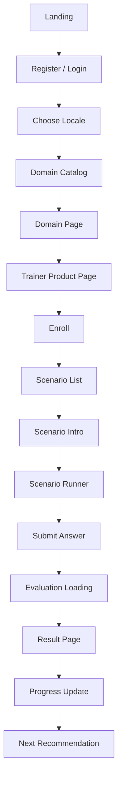
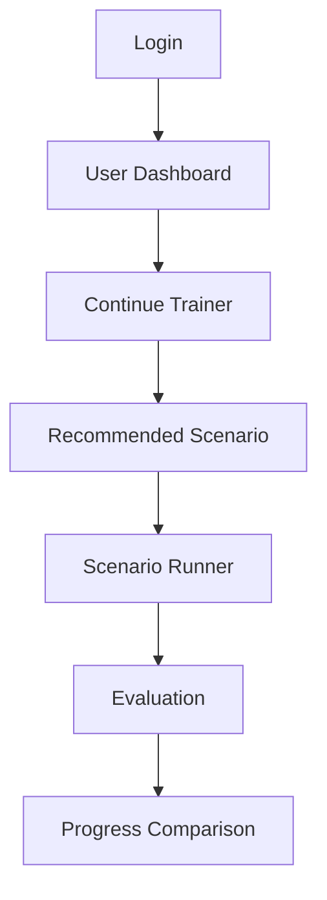
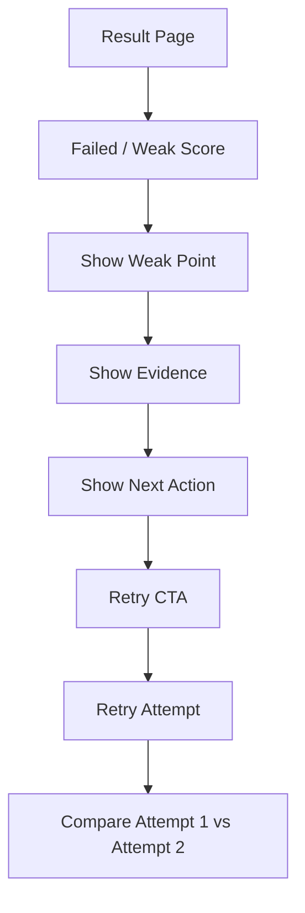
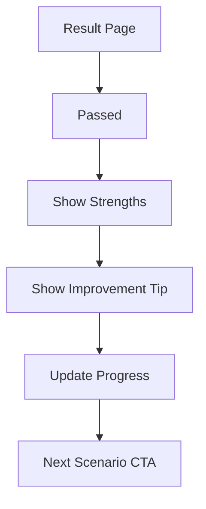

# UX/UI Designer Documentation Pack
# UX/UI-документация для платформы самодостаточных профессиональных тренажеров

**Версия:** 0.1  
**Дата:** 03.06.2026  
**Роль документа:** UX/UI Designer  
**Проект:** Trainer Platform — платформа самодостаточных профессиональных тренажеров  
**Статус:** Draft for Product / Architecture / Frontend / QA Review  

**Входные документы:**
- Product Owner Documentation Pack v0.1
- Business Analyst Documentation Pack v0.1
- Product Manager Documentation Pack v0.1
- System / Solution Architect Documentation Pack v0.1
- Learning Experience Designer Documentation Pack v0.1

---

## 0. Назначение документа

Этот документ фиксирует UX/UI-видение платформы самодостаточных профессиональных тренажеров.

UX/UI в этом проекте нужен не “для красоты”, а для того, чтобы пользователь:

- понял, что это платформа отдельных trainer products;
- быстро нашел нужный домен и тренажер;
- понял цель конкретного тренажера;
- прошел сценарий без путаницы;
- получил понятную оценку;
- понял свои слабые места;
- увидел следующий шаг;
- захотел повторить тренировку.

Главная UX-задача:

```text
Сделать прохождение тренажера понятным, спокойным, структурным и мотивирующим.
```

---

## 1. UX Product Principles

### 1.1. Платформа ≠ один большой тренажер

Интерфейс должен показывать:

```text
Platform
→ Domain
→ Trainer Product
→ Scenario
→ Attempt
→ Evaluation
→ Progress
```

Нельзя проектировать UI как один общий чат с выбором тем.

### 1.2. Каждый trainer product должен ощущаться самостоятельным

У каждого тренажера должны быть:

```text
своя product page
своя цель
свой прогресс
свои сценарии
свои результаты
свой readiness status
```

Пример:

```text
IT / QA Engineer Interview Trainer
```

должен ощущаться как отдельный продукт, а не как “одна вкладка в общем курсе”.

### 1.3. Тренажер — это guided practice, а не свободный AI chat

Пользователь должен видеть:

```text
контекст сценария
цель сценария
что от него ожидается
куда вводить ответ
когда завершится попытка
как будет оцениваться ответ
```

### 1.4. Feedback должен мотивировать, а не ломать

UX должен поддерживать тон:

```text
спокойно
конкретно
без унижения
без воды
с понятным следующим шагом
```

---

## 2. Primary User Flows

## 2.1. Main B2C Flow — First Training

```text
Landing
→ регистрация / вход
→ выбор языка
→ каталог доменов
→ выбор домена
→ выбор trainer product
→ trainer product page
→ enrollment
→ выбор сценария
→ запуск сценария
→ ответ пользователя
→ завершение attempt
→ AI evaluation
→ result page
→ progress update
→ next recommendation
```

### Flow Diagram



---

## 2.2. Returning User Flow

```text
Login
→ dashboard
→ continue trainer
→ recommended scenario
→ scenario attempt
→ evaluation
→ progress comparison
```



---

## 2.3. Failed Attempt Flow

```text
Scenario Result
→ score below pass
→ show main weak point
→ show evidence
→ show hint / structure
→ retry CTA
→ retry attempt
→ compare result
```



---

## 2.4. Passed Attempt Flow

```text
Scenario Result
→ score passed
→ show strengths
→ show small improvement area
→ update progress
→ next scenario recommendation
```



---

## 2.5. Admin Seed Review Flow — MVP-lite

В MVP полноценная Authoring Studio не входит, но может быть технический admin view.

```text
Admin login
→ trainer package list
→ validation status
→ package details
→ publish/draft status view
```

---

# 3. Information Architecture

## 3.1. Main Navigation

```text
Home
Domains
My Trainers
Progress
Profile
```

Later:

```text
Organizations
Authoring Studio
Marketplace
Billing
Admin
```

## 3.2. URL Structure

```text
/
/login
/register
/domains
/domains/[domainSlug]
/trainers/[trainerSlug]
/trainers/[trainerSlug]/scenarios
/scenarios/[scenarioId]/run
/attempts/[attemptId]/result
/me/dashboard
/me/progress
/me/progress/[trainerSlug]
/profile
```

## 3.3. Navigation Rules

```text
Guest can see landing, domains and trainer product previews.
Registered user can enroll and run scenarios.
Progress pages require login.
Admin pages require admin role.
```

---

# 4. Required Screens

## 4.1. Landing Page

### Goal

Объяснить, что это платформа профессиональных тренажеров, а не курс и не обычный AI-чат.

### Required Blocks

```text
Hero
Problem
How it works
Domain examples
Trainer product examples
Why not just ChatGPT
CTA
Trust / safety note
```

### Wireframe

```text
┌──────────────────────────────────────────────┐
│ Header: Logo | Domains | Login | Start        │
├──────────────────────────────────────────────┤
│ HERO                                         │
│ Платформа профессиональных AI-тренажеров     │
│ Тренируйте реальные ситуации, получайте      │
│ оценку по рубрике и измеряйте прогресс.      │
│ [Начать тренировку] [Посмотреть домены]      │
├──────────────────────────────────────────────┤
│ HOW IT WORKS                                 │
│ 1. Выберите домен                            │
│ 2. Выберите тренажер                         │
│ 3. Пройдите сценарий                         │
│ 4. Получите оценку                           │
│ 5. Повторите и улучшите результат            │
├──────────────────────────────────────────────┤
│ DOMAINS                                      │
│ [IT] [Medicine later] [Sales] [Languages]    │
├──────────────────────────────────────────────┤
│ WHY NOT CHATGPT                              │
│ Сценарии, рубрики, прогресс, рекомендации    │
├──────────────────────────────────────────────┤
│ CTA                                          │
│ [Попробовать QA Interview Trainer]           │
└──────────────────────────────────────────────┘
```

---

## 4.2. Domain Catalog Page

### Goal

Показать большие области, внутри которых находятся самостоятельные тренажеры.

### Required Elements

```text
domain cards
status labels
trainer count
short description
availability status
```

### Wireframe

```text
┌──────────────────────────────────────────────┐
│ Domains                                      │
│ Выберите область тренировки                  │
├──────────────────────────────────────────────┤
│ [IT]                                         │
│ Тренажеры для QA, Python, Data, AI           │
│ 1 доступен / 4 planned                       │
│ [Открыть]                                    │
├──────────────────────────────────────────────┤
│ [Sales]                                      │
│ Role-play продажи и возражения               │
│ planned                                      │
│ [Подробнее]                                  │
├──────────────────────────────────────────────┤
│ [Medicine]                                   │
│ Клинические и коммуникационные тренажеры     │
│ requires expert review                       │
│ [Подробнее]                                  │
└──────────────────────────────────────────────┘
```

---

## 4.3. Domain Page

### Goal

Показать trainer products внутри выбранного домена.

### Example

```text
Domain: IT
Trainer Products:
- QA Engineer Interview Trainer
- Prompt Engineer Interview Trainer later
- Python Developer Trainer later
- Data Analyst Trainer later
```

### Wireframe

```text
┌──────────────────────────────────────────────┐
│ IT Trainers                                  │
│ Самостоятельные тренажеры для IT-навыков     │
├──────────────────────────────────────────────┤
│ [QA Engineer Interview Trainer]              │
│ Подготовка к Junior QA interview             │
│ ru/en | text mode | 5 scenarios              │
│ [Открыть тренажер]                           │
├──────────────────────────────────────────────┤
│ [Prompt Engineer Trainer]                    │
│ planned                                      │
├──────────────────────────────────────────────┤
│ [Data Analyst Trainer]                       │
│ planned                                      │
└──────────────────────────────────────────────┘
```

---

## 4.4. Trainer Product Page

### Goal

Объяснить конкретный тренажер как самостоятельный продукт.

### Required Blocks

```text
trainer title
target audience
what user will practice
skill map summary
scenario count
duration
supported locales
readiness output
CTA enroll/start
```

### Wireframe

```text
┌──────────────────────────────────────────────┐
│ QA Engineer Interview Trainer                │
│ Тренажер подготовки к QA-собеседованию       │
│ Для Junior QA candidates                     │
│ ru-RU / en-US                                │
│ [Начать тренажер]                            │
├──────────────────────────────────────────────┤
│ Что вы будете тренировать                    │
│ ✓ Самопрезентация                            │
│ ✓ Баг-репорты                                │
│ ✓ Тест-кейсы и чеклисты                      │
│ ✓ Regression / retest                        │
│ ✓ Login form testing                         │
├──────────────────────────────────────────────┤
│ Как это работает                             │
│ Сценарий → ответ → оценка → feedback → retry │
├──────────────────────────────────────────────┤
│ Ваш результат                                │
│ Readiness score после прохождения сценариев  │
└──────────────────────────────────────────────┘
```

---

## 4.5. Enrollment Screen / Modal

### Goal

Пользователь должен понять, что он начинает конкретный trainer product.

### Required Text

```text
Вы начинаете QA Engineer Interview Trainer.
Прогресс будет сохраняться отдельно для этого тренажера.
```

### Wireframe

```text
┌──────────────────────────────────────────────┐
│ Начать QA Engineer Interview Trainer?        │
├──────────────────────────────────────────────┤
│ Вы получите:                                 │
│ - 5 стартовых сценариев                      │
│ - оценку по рубрике                          │
│ - рекомендации                               │
│ - прогресс по навыкам                        │
├──────────────────────────────────────────────┤
│ [Начать] [Отмена]                            │
└──────────────────────────────────────────────┘
```

---

## 4.6. Scenario List Page

### Goal

Показать сценарии внутри trainer product.

### Required Elements

```text
scenario cards
difficulty
estimated time
status
score if completed
recommended label
locked/unlocked later
```

### Wireframe

```text
┌──────────────────────────────────────────────┐
│ QA Interview Scenarios                       │
│ Progress: 2 / 5 completed                    │
├──────────────────────────────────────────────┤
│ Recommended                                  │
│ [Расскажите о себе]                          │
│ difficulty: basic | 7 min | not started      │
│ [Начать]                                     │
├──────────────────────────────────────────────┤
│ [Как вы оформляете bug report?]              │
│ score: 68 | retry recommended                │
│ [Повторить]                                  │
├──────────────────────────────────────────────┤
│ [Login form testing]                         │
│ locked until basics completed later          │
└──────────────────────────────────────────────┘
```

---

## 4.7. Scenario Intro Screen

### Goal

Перед началом сценария пользователь должен понять контекст и критерии.

### Required Elements

```text
scenario title
context
role
estimated time
skills trained
evaluation criteria preview
start button
```

### Wireframe

```text
┌──────────────────────────────────────────────┐
│ Сценарий: Как вы оформляете bug report?      │
├──────────────────────────────────────────────┤
│ Контекст:                                    │
│ Вы проходите собеседование на Junior QA.     │
│ Интервьюер спрашивает, как вы описываете баг.│
├──────────────────────────────────────────────┤
│ Тренируемые навыки:                          │
│ bug reporting, structure, clarity            │
├──────────────────────────────────────────────┤
│ Оценка будет по критериям:                   │
│ структура, ключевые поля, практичность       │
├──────────────────────────────────────────────┤
│ [Начать сценарий]                            │
└──────────────────────────────────────────────┘
```

---

## 4.8. Scenario Runner Screen

### Goal

Пользователь отвечает на вопрос/ситуацию.

### Required Elements

```text
scenario context compact
AI/interviewer question
answer input
hint button
progress within scenario
submit button
save state
```

### Wireframe

```text
┌──────────────────────────────────────────────┐
│ QA Interview Trainer                         │
│ Scenario: Bug report explanation             │
├──────────────────────────────────────────────┤
│ Интервьюер:                                  │
│ Как вы обычно оформляете баг-репорт?         │
├──────────────────────────────────────────────┤
│ Ваш ответ:                                   │
│ ┌──────────────────────────────────────────┐ │
│ │                                          │ │
│ │ Напишите ответ здесь...                  │ │
│ │                                          │ │
│ └──────────────────────────────────────────┘ │
├──────────────────────────────────────────────┤
│ [Подсказка]                     [Отправить] │
└──────────────────────────────────────────────┘
```

### Input Rules

```text
empty answer blocked
too short answer warning
max length warning
autosave draft optional later
```

---

## 4.9. Evaluation Loading Screen

### Goal

Не оставить пользователя в неопределенности.

### Required Elements

```text
clear loading state
what is happening
expected wait
do not close note
fallback message if slow
```

### Wireframe

```text
┌──────────────────────────────────────────────┐
│ Анализируем ваш ответ                        │
├──────────────────────────────────────────────┤
│ Система проверяет ответ по рубрике:          │
│ ✓ структура                                  │
│ ✓ предметная точность                        │
│ ✓ ясность                                    │
│ ✓ практичность                               │
│                                              │
│ Обычно это занимает несколько секунд.        │
└──────────────────────────────────────────────┘
```

---

## 4.10. Result Page

### Goal

Пользователь должен понять результат и следующий шаг.

### Required Blocks

```text
overall score
pass/fail/readiness state
criteria breakdown
strengths
weak points
evidence
next action
retry / next scenario CTA
```

### Wireframe

```text
┌──────────────────────────────────────────────┐
│ Результат сценария                           │
│ Score: 68 / 100                              │
│ Status: Нужно усилить                        │
├──────────────────────────────────────────────┤
│ Что получилось                               │
│ ✓ Вы упомянули steps to reproduce            │
├──────────────────────────────────────────────┤
│ Что улучшить                                 │
│ ! Не хватает expected и actual result        │
├──────────────────────────────────────────────┤
│ Разбор по критериям                          │
│ Structure: 3/5                               │
│ Key fields: 2/5                              │
│ Clarity: 4/5                                 │
├──────────────────────────────────────────────┤
│ Фрагмент из ответа                           │
│ "Я описываю проблему и шаги..."              │
├──────────────────────────────────────────────┤
│ Следующий шаг                                │
│ Повторите ответ по структуре:                │
│ title → steps → expected → actual → env      │
├──────────────────────────────────────────────┤
│ [Повторить сценарий] [Следующий сценарий]    │
└──────────────────────────────────────────────┘
```

---

## 4.11. User Dashboard

### Goal

Вернувшийся пользователь сразу понимает, где продолжить.

### Required Blocks

```text
active trainers
recommended next scenario
recent results
readiness status
continue CTA
```

### Wireframe

```text
┌──────────────────────────────────────────────┐
│ Добро пожаловать обратно                     │
├──────────────────────────────────────────────┤
│ Продолжить тренировку                        │
│ QA Engineer Interview Trainer                │
│ Progress: 2 / 5 scenarios                    │
│ Readiness: needs practice                    │
│ [Продолжить]                                 │
├──────────────────────────────────────────────┤
│ Рекомендация                                 │
│ Повторить: Bug report explanation            │
├──────────────────────────────────────────────┤
│ Последние результаты                         │
│ Self-presentation: 78                        │
│ Bug report: 68                               │
└──────────────────────────────────────────────┘
```

---

## 4.12. Progress Page

### Goal

Показать прогресс внутри конкретного trainer product.

### Required Elements

```text
trainer-specific progress
skill scores
completed scenarios
score trend
weak skills
recommended next steps
```

### Wireframe

```text
┌──────────────────────────────────────────────┐
│ QA Engineer Interview Trainer Progress       │
├──────────────────────────────────────────────┤
│ Readiness: Almost ready                      │
│ Average score: 76                            │
│ Completed: 4 / 5 scenarios                   │
├──────────────────────────────────────────────┤
│ Skills                                       │
│ Bug reporting          ██████░░ 68           │
│ Interview structure    ████████ 82           │
│ Test design            █████░░░ 61           │
│ Communication clarity  ████████ 84           │
├──────────────────────────────────────────────┤
│ Weak areas                                   │
│ - Test design                                │
│ - Bug report completeness                    │
├──────────────────────────────────────────────┤
│ Recommended                                  │
│ [Login form testing scenario]                │
└──────────────────────────────────────────────┘
```

---

## 4.13. Profile / Settings Page

### Required Elements

```text
name/email
preferred locale
market/country optional
active trainers
delete/export data later
```

---

## 4.14. Error Screens

### AI Evaluation Failed

```text
Мы сохранили вашу попытку, но не смогли сейчас завершить оценку.
Вы можете повторить оценку позже. Ответ не потерян.
[Попробовать оценить снова]
```

### Missing Locale

```text
Этот сценарий пока недоступен на выбранном языке.
Вы можете открыть его на языке по умолчанию.
[Открыть на русском] [Назад]
```

### Scenario Not Available

```text
Сценарий временно недоступен.
Мы не будем засчитывать попытку.
```

---

# 5. Design System

## 5.1. Design System Goals

Design system должен поддерживать:

```text
ясность
доверие
профессиональность
мягкую мотивацию
читаемость feedback
быстрое понимание статусов
```

---

## 5.2. Core Components

### Buttons

Types:

```text
Primary CTA
Secondary CTA
Danger / destructive
Ghost
Disabled
Loading
```

Examples:

```text
[Начать тренажер]
[Продолжить]
[Повторить сценарий]
[Посмотреть прогресс]
[Отмена]
```

### Trainer Card

Fields:

```text
title
domain
short description
status
locale badges
scenario count
progress if enrolled
CTA
```

### Domain Card

Fields:

```text
domain name
description
trainer count
availability status
icon
CTA
```

### Scenario Card

Fields:

```text
title
difficulty
duration
status
last score
recommended badge
CTA
```

### Progress Bar

Types:

```text
scenario completion
skill score
readiness progress
attempt progress
```

### Evaluation Score Block

Fields:

```text
overall score
status label
score interpretation
```

### Rubric Breakdown

Fields:

```text
criterion name
score
max score
feedback
evidence
```

### Hint Box

States:

```text
hidden
hint level 1
hint level 2
hint level 3
```

### Status Badge

Statuses:

```text
not_started
in_progress
completed
passed
needs_practice
retry_recommended
locked
draft
published
planned
```

### Alert / Error

Types:

```text
info
warning
error
success
AI failure
validation error
```

### Recommendation Card

Fields:

```text
next action
reason
CTA
```

---

## 5.3. Visual Tone

Рекомендуемый стиль:

```text
профессиональный
чистый
не перегруженный
без агрессивной геймификации
с мягкими элементами прогресса
```

Не рекомендуется:

```text
кислотные цвета
слишком много бейджей
сложные анимации в MVP
игровой хаос
давление через красные ошибки
```

---

## 5.4. Color Semantics

Без фиксации конкретной палитры, но с семантикой:

```text
Primary — основное действие
Neutral — текст, карточки, фон
Success — сценарий пройден
Warning — нужно усилить
Error — ошибка системы или critical error
Info — подсказка
Progress — рост навыка
```

---

## 5.5. Typography

Требования:

```text
feedback должен легко читаться
не использовать слишком мелкий текст
rubric breakdown должен быть сканируемым
важные выводы отделять визуально
```

Минимальные уровни:

```text
H1 — page title
H2 — section title
H3 — card title
Body — normal text
Small — metadata, но не для критически важной информации
```

---

## 5.6. Spacing and Layout

Правила:

```text
один основной CTA на экран
не показывать слишком много информации до первой попытки
result page разбивать на блоки
прогресс показывать визуально и текстом
```

---

# 6. UX Writing Guidelines

## 6.1. Основной тон

Тон продукта:

```text
спокойный
уважительный
конкретный
поддерживающий
без сюсюканья
без давления
без унижения
```

## 6.2. Feedback Writing Rules

Feedback должен:

```text
говорить, что получилось
говорить, что улучшить
объяснять почему
давать следующий шаг
ссылаться на ответ пользователя
```

Feedback не должен:

```text
писать "плохо", "неправильно", "вы не поняли"
обобщать без доказательств
перегружать теорией
давать generic AI-фразы
```

---

## 6.3. Good UX Copy Examples

### Weak but supportive

```text
Ответ уже в правильном направлении, но ему не хватает структуры.
Добавьте expected result и actual result, чтобы баг-репорт был понятнее разработчику.
```

### Strong result

```text
Хороший ответ. Вы назвали ключевые части баг-репорта и объяснили, зачем нужны шаги воспроизведения.
Следующий шаг — потренироваться на практическом кейсе.
```

### Critical error

```text
В ответе есть критичная ошибка: вы указали, что шаги воспроизведения не обязательны.
Для QA это важная часть баг-репорта, потому что без нее проблему сложно проверить.
```

### Retry CTA

```text
Повторить и улучшить ответ
```

### Next scenario CTA

```text
Перейти к следующему сценарию
```

---

## 6.4. Bad UX Copy Examples

```text
Вы ответили плохо.
```

```text
Ваш ответ неправильный.
```

```text
Попробуйте лучше.
```

```text
Ответ не соответствует ожиданиям.
```

Почему плохо:

```text
нет конкретики
нет следующего шага
звучит обвиняюще
не помогает учиться
```

---

## 6.5. Microcopy Rules

### Empty answer

```text
Напишите хотя бы короткий ответ, чтобы система могла его оценить.
```

### Too short answer

```text
Ответ слишком короткий для полноценной оценки. Добавьте 2–3 детали.
```

### Loading

```text
Проверяем ответ по рубрике.
```

### Saved attempt

```text
Попытка сохранена.
```

### Failed AI evaluation

```text
Ответ сохранен, но оценку сейчас получить не удалось.
```

---

# 7. UX States

## 7.1. User States

```text
guest
registered_no_enrollment
enrolled_no_attempts
active_training
completed_some_scenarios
ready_for_next
needs_practice
completed_trainer
```

## 7.2. Trainer States

```text
planned
draft
published
deprecated
archived
```

## 7.3. Scenario States for User

```text
not_started
started
completed_waiting_evaluation
evaluated_passed
evaluated_needs_practice
retry_recommended
locked_later
```

## 7.4. Evaluation States

```text
not_requested
in_progress
succeeded
failed_retryable
failed_non_retryable
```

---

# 8. Responsive Design Requirements

## 8.1. Desktop

Оптимально для:

```text
длинных ответов
result breakdown
progress dashboard
rubric review
```

## 8.2. Tablet

Должен поддерживать:

```text
scenario runner
result page
progress overview
```

## 8.3. Mobile

MVP должен быть usable на mobile, но не обязан быть mobile-first.

Mobile rules:

```text
answer input should be comfortable
result blocks should stack vertically
sticky submit button optional
avoid huge tables
cards over wide grids
```

---

# 9. Accessibility Requirements

Минимально:

```text
keyboard navigation
visible focus states
sufficient contrast
form labels
ARIA for loading/error states where needed
do not rely only on color for status
clear error messages
```

Examples:

```text
Warning status must have text label, not only yellow color.
Score must be shown as number and interpretation.
```

---

# 10. UX Analytics Events

UX должен поддержать сбор событий:

```text
landing_cta_clicked
domain_card_clicked
trainer_card_clicked
trainer_enroll_clicked
scenario_start_clicked
hint_clicked
answer_submitted
evaluation_result_viewed
retry_clicked
next_scenario_clicked
progress_opened
locale_changed
```

Для каждого события желательно передавать:

```text
domain_slug
trainer_slug
scenario_id
locale
user_state
screen_name
```

---

# 11. UX Edge Cases

| Edge Case | UX Behavior |
|---|---|
| Пользователь не зарегистрирован и нажал Start | Показать register/login, затем вернуть к trainer |
| Нет доступных тренажеров в домене | Показать planned trainers и waitlist CTA later |
| Сценарий недоступен на языке | Предложить fallback locale |
| Пользователь обновил страницу во время сценария | Попытаться восстановить session |
| AI evaluation failed | Объяснить, что ответ сохранен |
| Score низкий | Поддержать и дать retry |
| Score высокий | Дать next scenario |
| Нет прогресса | Показать empty state с первым действием |
| Пользователь прошел все сценарии | Показать summary и next trainer/waitlist |
| Trainer deprecated | Показать предупреждение и новую версию if available |

---

# 12. Empty States

## No enrolled trainers

```text
У вас пока нет активных тренажеров.
Выберите первый тренажер и пройдите короткий сценарий.
[Открыть каталог]
```

## No progress yet

```text
Прогресс появится после первой завершенной попытки.
[Начать первый сценарий]
```

## No scenarios available

```text
В этом тренажере пока нет опубликованных сценариев.
```

---

# 13. UX Acceptance Criteria

## Landing

```gherkin
Given a new visitor opens the landing page
When they read the hero section
Then they understand that the product offers professional AI trainers with rubric-based feedback
```

## Domain Catalog

```gherkin
Given a user opens the domain catalog
When domains are displayed
Then each domain clearly shows available and planned trainer products
```

## Trainer Product Page

```gherkin
Given a user opens a trainer product page
When they view the page
Then they see target audience, skills, scenarios, language support and start CTA
```

## Scenario Runner

```gherkin
Given a user starts a scenario
When the scenario runner opens
Then the user sees context, interviewer question, answer input, hint button and submit button
```

## Result Page

```gherkin
Given evaluation is completed
When the result page opens
Then the user sees overall score, criteria breakdown, strengths, weak points, evidence and next action
```

## Progress Page

```gherkin
Given a user has completed attempts
When they open progress page
Then progress is shown per trainer product and per skill
```

## UX Writing

```gherkin
Given feedback is displayed
When the user reads it
Then it must be respectful, specific, evidence-based and include a next step
```

---

# 14. Required UX/UI Artifacts

```text
ux_ui_documentation_pack.md
user_flow_diagrams.md
screen_wireframes.md
design_system_components.md
ux_writing_guidelines.md
responsive_requirements.md
accessibility_requirements.md
ux_acceptance_criteria.md
```

In this package, all artifacts are consolidated into one document.

---

# 15. Handoff to Frontend

Frontend team must receive:

```text
route map
screen list
component list
UX states
copy examples
error states
responsive rules
acceptance criteria
```

Frontend implementation must not:

```text
hardcode one trainer as entire platform
hide trainer product model
store authoritative progress only in browser
show AI feedback as unstructured wall of text
show low score in humiliating way
```

---

# 16. UX/UI Proof JSON

```json
{
  "document": "ux_ui_designer_documentation_pack",
  "version": "0.1",
  "user_flows_defined": true,
  "wireframes_defined": true,
  "design_system_defined": true,
  "ux_writing_guidelines_defined": true,
  "screen_states_defined": true,
  "responsive_requirements_defined": true,
  "accessibility_requirements_defined": true,
  "ux_analytics_events_defined": true,
  "acceptance_criteria_defined": true,
  "platform_model": "platform_domain_trainer_product_scenario_attempt_evaluation_progress",
  "first_trainer": "QA Engineer Interview Trainer",
  "mvp_mode": "text_only",
  "locales": ["ru-RU", "en-US"],
  "forbidden": [
    "one_mega_trainer_ui",
    "free_chat_as_main_experience",
    "humiliating_feedback",
    "generic_ai_feedback_wall",
    "progress_without_trainer_context"
  ]
}
```

---

# 17. Final UX/UI Verdict

```json
{
  "ux_ui_verdict": "ACCEPTED_AS_DRAFT_FOR_FRONTEND_AND_PRODUCT_REVIEW",
  "main_ux_goal": "make_self_contained_trainer_products_easy_to_find_start_complete_and_retry",
  "primary_flow": "landing_registration_domain_trainer_enrollment_scenario_evaluation_progress_recommendation",
  "required_mvp_screens": [
    "landing",
    "domain_catalog",
    "domain_page",
    "trainer_product_page",
    "scenario_list",
    "scenario_intro",
    "scenario_runner",
    "evaluation_loading",
    "result_page",
    "dashboard",
    "progress_page",
    "profile"
  ],
  "design_system_focus": [
    "trainer_cards",
    "scenario_cards",
    "progress_bars",
    "evaluation_blocks",
    "rubric_breakdown",
    "status_badges",
    "hint_boxes",
    "recommendation_cards"
  ],
  "ux_writing_rule": "respectful_specific_evidence_based_next_step",
  "next_required_document": "First Trainer Product UX Prototype or Frontend Implementation Spec"
}
```

---

## 18. Final Notes

Главное UX-решение:

```text
Пользователь должен всегда понимать:
где он находится,
какой тренажер проходит,
какой сценарий выполняет,
по каким критериям его оценят,
что получилось,
что улучшить,
что делать дальше.
```

Если это соблюдено, продукт будет ощущаться как профессиональный тренажер, а не как обычный AI-чат.
